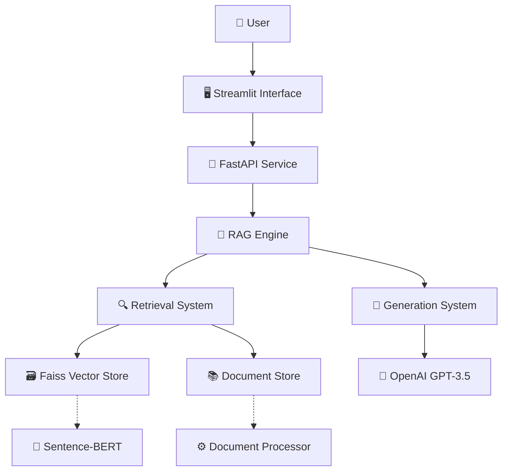

# Architecture Documentation v4
# 旅遊不便險 RAG Chatbot 系統架構

## 📋 Document Information
- **Version**: v4.0
- **Date**: 2025-01-03
- **Project**: RAG Insurance Chatbot
- **Architecture Style**: Microservices (Simplified for MVP)
- **Deployment**: Local Development Environment

---

## 🏗️ System Architecture Overview

### High-Level Architecture



### Core Components

1. **用戶界面層 (Presentation Layer)**
   - Streamlit Web Interface
   - 問答互動界面
   - 結果展示與可視化

2. **API 服務層 (Service Layer)**  
   - FastAPI RESTful Services
   - 請求路由與驗證
   - 回應格式化

3. **RAG 引擎層 (Business Logic Layer)**
   - 檢索引擎 (Retrieval Engine)
   - 生成引擎 (Generation Engine)
   - 結果融合與後處理

4. **數據存儲層 (Data Layer)**
   - Vector Database (Faiss)
   - Document Store (Memory/JSON)
   - Configuration & Metadata

---

## 📁 Project Structure

```
rag-insurance-chatbot/
├── 📄 README.md
├── 📄 requirements.txt
├── 📄 .env
├── 🐳 Dockerfile
├── 📁 src/
│   ├── 📄 __init__.py
│   ├── 📄 config.py              # 系統配置
│   ├── 📄 models.py              # 資料模型定義
│   ├── 📄 main.py                # FastAPI 主應用
│   ├── 📁 processing/
│   │   ├── 📄 __init__.py
│   │   └── 📄 document_processor.py
│   ├── 📁 retrieval/
│   │   ├── 📄 __init__.py
│   │   └── 📄 retriever.py
│   ├── 📁 generation/
│   │   ├── 📄 __init__.py
│   │   └── 📄 generator.py
│   └── 📁 api/
│       ├── 📄 __init__.py
│       └── 📄 routes.py
├── 📁 data/
│   ├── 📄 sample_clauses.json    # 樣本保險條款
│   ├── 📄 test_questions.json   # 測試問題集
│   └── 📁 indices/              # 向量索引存儲
├── 📁 tests/
│   ├── 📄 __init__.py
│   ├── 📄 test_retrieval.py
│   ├── 📄 test_generation.py
│   └── 📄 test_integration.py
├── 📁 docs/
│   ├── 📄 prd.md
│   ├── 📄 architecture.md
│   └── 📁 architecture/         # 詳細架構文檔
└── 📁 scripts/
    ├── 📄 setup.py              # 環境設置腳本
    ├── 📄 build_index.py        # 索引建構腳本
    └── 📄 run_tests.py          # 測試執行腳本
```

---

## 🔧 Component Architecture

### Retrieval System Architecture

```python
# 檢索系統核心架構
class RetrievalSystem:
    components:
        - DocumentProcessor: 條款文檔預處理
        - EmbeddingEngine: 文本向量化 (Sentence-BERT)
        - VectorStore: 向量存儲與檢索 (Faiss)
        - RankingEngine: 結果排序與過濾
    
    data_flow:
        Query → Embedding → Vector Search → Ranking → Results
```

### Generation System Architecture  

```python
# 生成系統核心架構
class GenerationSystem:
    components:
        - PromptEngine: 提示詞工程與模板管理
        - LLMInterface: 語言模型介面 (OpenAI API)
        - ResponseProcessor: 回應後處理與格式化
        - CitationManager: 來源引用管理
    
    data_flow:
        Context + Query → Prompt → LLM → Response → Citation → Output
```

---

## 📊 Data Architecture

### Document Schema

```json
{
  "document": {
    "id": "string",
    "content": "string", 
    "metadata": {
      "clause_type": "coverage|procedure|exclusion",
      "category": "delay|baggage|medical|general",
      "article_number": "string",
      "chunk_id": "integer",
      "source_file": "string",
      "created_at": "timestamp"
    },
    "embedding": "float[]"
  }
}
```

### API Response Schema

```json
{
  "response": {
    "query": "string",
    "answer": "string",
    "confidence": "float",
    "sources": [
      {
        "content": "string",
        "article_number": "string", 
        "relevance_score": "float"
      }
    ],
    "response_time_ms": "integer",
    "timestamp": "string"
  }
}
```

---

## ⚡ Performance Architecture

### Caching Strategy
```
Level 1: Application Cache (在記憶體)
├── Query Results Cache (LRU, 100 entries)
├── Embedding Cache (最近查詢向量)
└── Prompt Templates Cache

Level 2: Vector Index Cache  
├── Faiss Index (持久化到磁盤)
└── Document Store (JSON文件)
```

### Optimization Strategies
1. **Embedding Reuse**: 相似查詢的向量重用
2. **Batch Processing**: 多查詢批次處理
3. **Index Optimization**: Faiss IVF 參數調優
4. **Response Caching**: 常見問題結果緩存

---

## 🔒 Security Architecture

### MVP Security Model
```
Authentication: None (演示版本)
├── API Security: Rate limiting (基礎)
├── Data Security: 本地存儲，無敏感數據
└── Environment: .env 檔案管理 API keys

Production Considerations:
├── API Authentication (JWT tokens)
├── Input Validation & Sanitization  
├── Audit Logging
└── Data Encryption (at rest & in transit)
```

---

## 🧪 Testing Architecture  

### Test Strategy
```
Unit Tests (70%):
├── Document Processing Logic
├── Embedding Generation
├── Vector Search Functions
└── Response Generation

Integration Tests (20%):
├── End-to-End RAG Pipeline
├── API Endpoint Testing
└── Database Operations

System Tests (10%):
├── Performance Testing
├── Load Testing (基礎)
└── User Acceptance Testing
```

---

## 📈 Scalability Architecture

### Current MVP Limitations
- Single-instance deployment
- In-memory document store
- No load balancing
- Local file-based vector storage

### Future Scalability Path
```
Phase 1 (Current): Single Node
├── Local Faiss Index
├── In-memory Document Store
└── Single API Instance

Phase 2 (Production Ready):
├── Distributed Vector Database (Pinecone/Weaviate)
├── Redis Caching Layer
├── Load Balancer + Multiple API Instances
└── Database for Document Management

Phase 3 (Enterprise Scale):
├── Microservices Architecture
├── Message Queue (RabbitMQ/Kafka)
├── Container Orchestration (Kubernetes)
└── Advanced Monitoring & Observability
```

---

## 🔄 Deployment Architecture

### Development Environment
```
Local Development:
├── Python Virtual Environment
├── Docker Compose (optional)
├── Local Faiss Index
└── Streamlit Dev Server

Dependencies:
├── Python 3.8+
├── Faiss (CPU version)
├── Sentence-Transformers
├── OpenAI Python Client
├── FastAPI + Uvicorn
└── Streamlit
```

### Production Readiness Checklist
- [ ] Container Security Scanning
- [ ] Health Check Endpoints
- [ ] Structured Logging
- [ ] Monitoring Integration  
- [ ] Configuration Management
- [ ] Database Migration Scripts
- [ ] Backup & Recovery Procedures

---

## 📚 Architecture Decisions Record (ADR)

### ADR-001: Vector Database Selection
**Decision**: Use Faiss for MVP
**Rationale**: Fast development, no external dependencies, sufficient for demo
**Trade-offs**: Limited scalability, no managed service benefits
**Review Date**: After MVP validation

### ADR-002: LLM Provider Selection  
**Decision**: OpenAI GPT-3.5-turbo
**Rationale**: Proven performance, good Chinese support, reasonable cost
**Trade-offs**: External API dependency, per-token cost
**Alternatives Considered**: Local models (too complex for MVP timeline)

### ADR-003: Frontend Technology
**Decision**: Streamlit for MVP demonstration
**Rationale**: Rapid prototyping, Python-native, good for technical demos
**Trade-offs**: Limited customization, not production-ready
**Future Consideration**: React/Vue.js for production version

---

## 🔍 Architecture Quality Attributes

### Performance Goals
- **Response Time**: P95 < 5 seconds
- **Throughput**: 10 queries/minute (演示負載)  
- **Availability**: 99% uptime during demo period
- **Resource Usage**: < 4GB RAM, < 2GB disk

### Quality Metrics
- **Code Coverage**: Target 80%+
- **Technical Debt**: Documented and time-boxed
- **Security**: Basic security practices implemented
- **Maintainability**: Clear separation of concerns

---

## 📋 Implementation Roadmap

### Day 0.5 (Infrastructure)
- [x] Project structure setup
- [x] Dependency management  
- [x] Configuration system
- [x] Basic logging setup

### Day 1 (Core System)
- [ ] Document processing pipeline
- [ ] Vector embedding generation
- [ ] Faiss index construction
- [ ] Basic retrieval functionality

### Day 2 (RAG Integration)
- [ ] LLM integration
- [ ] Prompt engineering
- [ ] Response generation
- [ ] Citation system

### Day 3 (Testing & Demo)  
- [ ] Integration testing
- [ ] Demo interface
- [ ] Performance optimization
- [ ] Documentation completion

---

_This architecture document serves as the technical blueprint for the MVP development phase and provides the foundation for future scalability._